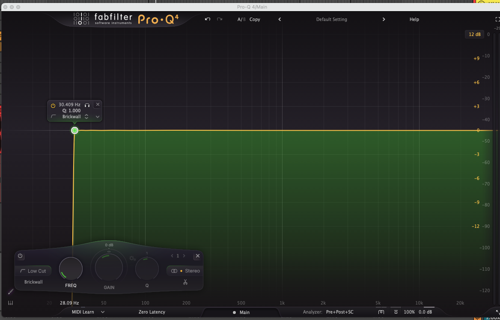

# This is my Music production hub
---

Back to [Index](/index.md/)

---

## 🛠️ General Production Guidelines

This is how i equalize my tracks
I cut everything under 30hz

 

- ### 🎚️ Mastering Cuts
  
    Cut everything under 30Hz on the master.

    For intros, cut below 90Hz to let low pads breathe.

- ### 🧪 Sound Design
  
    Use reverb, FX, and layering to extract the most from samples.
  
    Prioritize layering, but aim to maximize each sound creatively.

- ### 🔗 Sidechain Tips
  
  Sidechain sub and mid bass to kick and snare.

- ### 📈 Loudness Target
  
    Use a limiter on the master to hit 3 to -5 LUFS.

---

## 🎚️ Mixing Strategy

### 🪓 Clipping Philosophy

- ✅ Clip everything — don’t traditional gain stage.
- 🎤 Compress vocals only.
- 🔪 Use a clipper for everything else.
- 🔊 Reference Volume Levels

---

### All track elements level (dB)
-   Kick	-6
-   Snare	-6
-   Sub Bass	-9.5 to -11
-   Mid Bass	-9.5 to -15
-   Background Perc (Noise)	-15 to -20
-   Main Open Hat	-9 to -11
-   Lead	-10
-   Vocal	-10
-   Driving Perc (1/8th rhythm)	-10 to -8

---

## 🎼 Composition Tips

- ### 🎹 Start With 
    Arp + Pad
  
- ### 🧠 Melody Writing
  
    Start with the root note

    Add the 5th or 7th

- ### 🎵 Chords First
    
    Focus on harmony before melody or groove

---

## 🎨 Creative Notes

- ### 🔊 Intro Tip 
    Use a low pad without bass (<90Hz) to create mystery
  
- ###  🧰 Sample Techniques:
  
    Add reverb

    Layer additional samples

    Combine both for unique texture

---

Back to [Index](/index.md/)

---